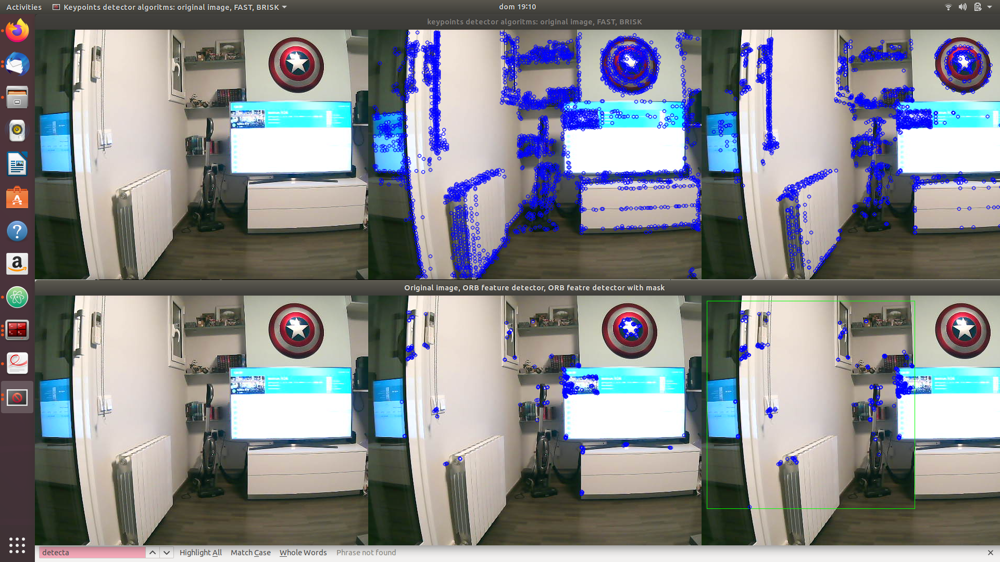

# webcam_point_features
see in  [ORB](https://opencv-python-tutroals.readthedocs.io/en/latest/py_tutorials/py_feature2d/py_orb/py_orb.html)

## ORB Definition:
### ORB: Oriented Fast and Rotated BRIEF

ORB is a feature detection and description, basically it's a fusion between a corner detection [FAST](https://opencv-python-tutroals.readthedocs.io/en/latest/py_tutorials/py_feature2d/py_fast/py_fast.html) and [BRIEF](https://opencv-python-tutroals.readthedocs.io/en/latest/py_tutorials/py_feature2d/py_brief/py_brief.html) descriptor with many modifications  to enhance the performance.
First it use FAST algorithm to find keypoints, then it applies Harris corner measure to find top N points among them and it also use pyramid to produce multiscale-features.
As FAST doesn't compute the orientation, the algorithm computes the intensity weighted centroid of the patch with located corner at center. The direction of the vector from this corner point to centroid gives the orientation and computes moments with x and y. Then, BRIEF descriptors are used according to the orientation of keypoints.

For descriptor matching, multi-probe [LSH](https://en.wikipedia.org/wiki/Locality-sensitive_hashing) is used.

The paper says ORB is much faster than SURF and SIFT and ORB descriptor works better than SURF. ORB is a good choice in low-power devices for panorama stitching etc.

## CODE

There are the following functions:

1. **orb_base**(input image, keypoints to compute, detector to compute, descriptor to compute) -> is the base ORB feature detection function.
2. **orb_base_mask**(input image, keypoints to compute,detector to compute, descriptor to compute, mask rectangle x,mask rectangle y, mask rectangle width, mask rectangle height) -> is the base ORB feature detection function computed to a mask.
3. **FastFeatureDetector**(input image, keypoints to compute) -> keypoint detector based on FAST corner detection.
4. **BriskDetector**(input image, keypoints to compute, descriptor to compute) -> keypoint detector based on Brisk and description extractor

### Output

It obtains the following images:
1. Keypoint detector algorithms: original image, FAST obtained image, BRISK obtained image
2. ORB detection descriptor: original image, ORB feature detector, ORB feature detector with mask.
3. As it is shown in the following image:

## Run the code

1. Make a new directory named build
2. go to build and execute *cmake ..* and then *make*.
3. Run file *./point_features* - (you have a webcam installed).
